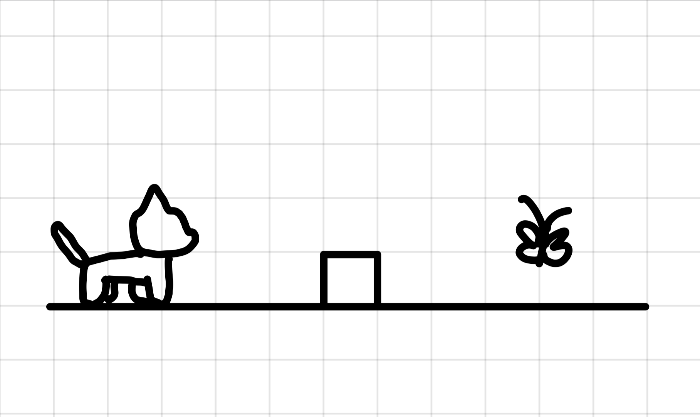
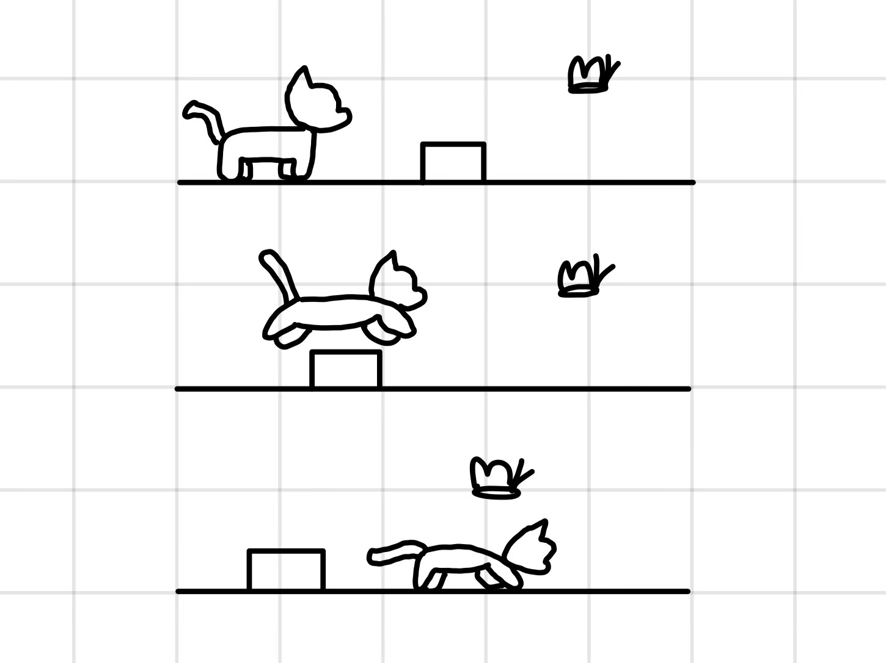

:warning: Everything between << >> needs to be replaced (remove << >> after replacing)

# Cat Game
## CS110 Final Project  << Fall, 2024 >>

## Team Members

Amanda Joa and Breanna Cheung
***

## Project Description

 A cat game where the characer jumps over obstacles and it gets harder the higher the levels get. 

## GUI Design

### Initial Design

### Final Design

## Program Design

### Features

1. Start menu
2. Moveable character
3. Game over screen
4. Obstacle Collisions
5. Points

### Classes
Cat.py
    def __init__(self, x, y, img_file):
        - initiliazes the cat object
    def update_position(self, new_x, new_y):
        - updates the position of the cat
    def jump(self):
        - makes the cat jump
     def duck(self):
        - makes the cat duck

Controller.py
    def __init__(self):
        - initalizes the controller object
    def mainloop(self):
        - main loop which detects collisions, redraws and displays the neext frame and caps the frame rate
    def update_models(self):
        - detects collisions and updates models
     def redraw(self):
        - redraws the next game

    
## ATP

| Step                 |Procedure             |Expected Results                   |
|----------------------|:--------------------:|----------------------------------:|
|  1                   | Run Counter Program  |GUI window appears with count = 0  |
|  2                   | click count button   | display changes to count = 1      |
etc...
Test Case 1: Player Movement: Verify that the player's cat moves right, up, and down as expected.
Test Steps: 
1. Start the game.
2. Press the right arrow key.
3. Verify that the player's cat moves right.
4. Press the up arrow key.
5. Verify that the player's cat jumps.
6. Press the down arrow key.
7. Verify that the player's cat ducks.
Expected Outcome: The players cat should move right, up, and down in response to the arrow key inputs.

Test Case 3: Game Over Condition
Test Description: Confirm that the game ends when the player's cat hits an obstacle.
Test Steps:
1. Start the game.
2. Play until the player hits an obstacle.
3. Verify that the game displays a "Game Over" message.
Expected Outcome: The game should display a "Game Over" message when the player's cat hits an obstacle.

Test Case 4: Menu Navigation
Test Description: Test the navigation through the game's main menu.
Test Steps:
1. Start the game.
2. Navigate through the main menu options (Start Game, Options, Quit).
3. Verify that each option is selectable and leads to the expected actions.
Expected Outcome: The main menu should allow the player to navigate through options and select them.

Test Case 5: Error Handling
Test Description: Verify that the program handles unexpected inputs gracefully.
1. Test Steps:
2. Start the game.
3. Enter invalid characters or inputs during gameplay.
4. Verify that the program does not crash and displays appropriate error messages.
Expected Outcome: The program should handle unexpected inputs without crashing and display user-friendly error messages.